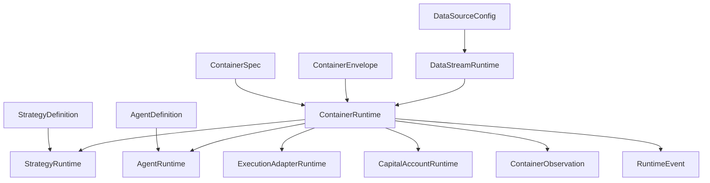

# NEMT Runtime 容器边界扩张设计稿

## 文档目的

本文档不是为了新增一批页面，也不是为了在当前容器模块上继续堆功能点。

本文档要回答的问题是：

> 在保持现有功能节点大体不变的前提下，如何把 NEMT Runtime 中“容器”这一概念从基础设施对象，扩张为一个更高维度的软件边界？

当前仓库中的容器更接近一个 UI 里的管理对象：

- 创建容器
- 配置镜像、端口、环境变量
- 绑定策略
- 查看运行状态

这套能力作为“功能”没有问题，但作为“边界”还太薄。

如果 NEMT Runtime 想成为一个值得长期投入、可以持续消耗大规模建模与推演成本、可以承载复杂 runtime 世界的系统，那么“容器”不能只是一个 Docker 风格的列表项。

它需要升级为：

- 运行时的宿主边界
- 治理边界
- 数据流入口边界
- 资本权限边界
- Agent 驻留边界
- 事件与观测归属边界
- 恢复与隔离边界

这就是本文要定义的“边界扩张一维”。

---

## 一句话结论

本次扩张的核心不是增加“容器功能”，而是重写“容器语义”。

从现在开始，容器不再被理解为：

- 一个用来跑策略的技术对象

而要被理解为：

- 一个承载 Definition、Runtime、Policy、Observation、Event、Recovery 的 Runtime Boundary Unit

也就是说，容器将从“对象”升级为“边界壳”。

---

## 1. 背景判断

### 1.1 当前代码层面的现实

从现有仓库可以看出，项目已经有了几个正确方向：

- 文档中已经提出 Definition / Runtime / Flow / Observation 的分层意识
- `types/` 下已经开始铺设较大的领域名词表
- `stores/` 也已经按策略、组合、风险、信号、订阅等领域拆分
- UI 端已经具备若干运营台式页面

但真正的问题也很明显：

- `App.tsx` 仍然是比较重的业务调度中心
- 类型系统和 store 之间存在重复定义
- 容器在语义上仍然偏“基础设施配置项”
- 运行时关系图谱没有真正形成
- 容器还没有成为系统中的中心关系节点

换句话说，项目现在已经具备“词汇量扩张”的趋势，但还没有完成“边界抬升”。

### 1.2 为什么不是继续加功能

如果继续沿着当前路径前进，很容易出现以下问题：

- 容器页面越来越复杂，但容器仍只是页面对象
- 策略、数据源、组合、信号、风控、Agent 分别长成多个平行岛屿
- 每个页面都维护自己的局部理解
- 系统缺少一套统一回答“谁在何处、以何种权限、基于何种输入、发出了什么输出”的能力

这会让系统越来越像一个多页面控制台，而不是一个 runtime host。

因此，这次扩张必须是“边界扩张”，而不是“功能膨胀”。

### 1.3 为什么优先从容器边界下手

之所以优先扩容器边界，而不是先扩策略、资本、数据流，有几个原因：

1. 容器天然适合做“宿主”语义
2. 容器天然适合做“隔离”语义
3. 容器天然适合做“运行时归属”语义
4. 容器天然适合做“恢复与治理”语义
5. 容器可以成为 runtime graph 中一个很好的中心轴

也就是说，容器是一个非常适合承接“软件边界扩张”的切口。

---

## 2. 本次扩张到底扩什么

### 2.1 不扩什么

本次扩张不以新增下列东西为目标：

- 不以新增页面数量为目标
- 不以新增按钮、弹窗、交互路径为目标
- 不以支持更多容器镜像字段为目标
- 不以做一个更完整的 Docker 面板为目标

这些都可能在实施过程中顺带发生变化，但都不是本次工作的核心。

### 2.2 真正要扩的是哪一个维度

要扩的是：

> 容器作为软件边界的语义维度

也就是把容器从“技术容器”扩成“运行时边界单元”。

扩张后的容器将同时承接七种边界：

1. 计算边界
2. 执行边界
3. 数据边界
4. 权限边界
5. 资本边界
6. 观测边界
7. 恢复边界

### 2.3 这意味着什么

未来系统不应只是回答：

- 这个容器用什么镜像
- 这个容器开了几个端口
- 这个容器目前 CPU 多高

而应能回答：

- 这个容器承载了哪些 runtime unit
- 它允许什么数据进入
- 它可以发出什么等级的执行动作
- 它受哪些风险政策约束
- 它可接触哪些资本账户或资本桶
- 它的事件归属和日志边界在哪里
- 它失败后采用什么恢复与隔离策略

这就是边界扩张一维后的效果。

---

## 3. 新的容器观：Container as Runtime Boundary Unit

### 3.1 新定义

新的容器概念定义如下：

> Container 是 NEMT Runtime 中用于承载、隔离、治理、观测和恢复一个或多个 runtime unit 的边界壳。

这个定义里有几个关键词：

- 承载
- 隔离
- 治理
- 观测
- 恢复
- 一个或多个 runtime unit

### 3.2 为什么要从“技术对象”转向“边界壳”

技术对象的视角关心的是：

- 镜像
- 端口
- 进程
- 资源

边界壳的视角关心的是：

- 这个单元内部允许发生什么
- 这个单元与外部如何连接
- 这个单元内部行为由谁治理
- 这个单元输出如何被观测
- 这个单元出问题后如何恢复

对于要做大知识地图的软件来说，后者比前者更重要。

### 3.3 一个容器不等于一个策略

扩张后的模型必须明确：

- 容器不是策略
- 容器不是数据源
- 容器不是资本
- 容器不是 Agent
- 容器不是风险系统

但容器可以承载：

- `StrategyRuntime`
- `AgentRuntime`
- `ExecutionAdapterRuntime`
- `DataWorkerRuntime`
- `PortfolioRuntime` 的局部执行单元

容器的本质是宿主，不是业务实体本身。

---

## 4. 现状模型与目标模型对比

### 4.1 当前模型

当前容器模型大致近似于：

```ts
interface Container {
  id: string;
  name: string;
  image: string;
  status: 'running' | 'stopped' | 'error' | 'starting';
  ports: ContainerPort[];
  envVars: Record<string, string>;
  cpu?: number;
  memory?: string;
  strategy?: string;
}
```

这个模型能满足页面管理需要，但不够承载高维 runtime 边界。

### 4.2 它的问题

这个模型存在以下问题：

1. Definition 与 Runtime 混在一起
2. 容器承载关系没有被正式建模
3. 没有治理层
4. 没有观测层
5. 没有恢复层
6. 没有事件边界
7. 没有权限边界
8. 没有数据入站/出站边界
9. 没有资本约束边界

### 4.3 目标模型

目标模型中，容器被拆成至少三层核心对象：

- `ContainerSpec`
- `ContainerRuntime`
- `ContainerEnvelope`

其中：

- `ContainerSpec` 负责定义
- `ContainerRuntime` 负责运行状态
- `ContainerEnvelope` 负责治理、权限、恢复、观测契约

必要时还可以继续分：

- `ContainerBinding`
- `ContainerObservation`
- `ContainerRecoveryProfile`
- `ContainerIngressProfile`
- `ContainerExecutionProfile`

---

## 5. 核心设计原则

### 5.1 边界优先于对象丰富度

不要先追求字段越来越多，而要先追求边界越来越清晰。

错误方向：

- 往 `Container` 上继续堆 50 个属性

正确方向：

- 先把容器拆成 Definition / Runtime / Envelope / Event / Observation

### 5.2 容器必须成为关系节点

如果改完之后容器仍然只是一个列表项，这次扩张就是失败的。

成功的标准是：

- 策略 runtime 能挂到容器上
- Agent runtime 能挂到容器上
- 数据接入关系能挂到容器上
- 事件能归属到容器上
- 风险与资本权限能约束容器

### 5.3 边界要大，但壳要轻

边界扩张不等于把一切逻辑塞进容器模块。

容器应该成为一个“组织关系和治理语义的壳”，而不是一个吞并所有业务逻辑的大对象。

### 5.4 不让 provider shape 成为 domain shape

容器的领域建模不能直接等同于某个具体容器引擎的 API。

比如：

- Docker 的字段不是领域真相
- Kubernetes 的对象名词也不是领域真相
- 某个云平台的 runtime 术语也不是领域真相

领域模型应该先表达 NEMT Runtime 的边界需要，然后通过 adapter 去适配外部实现。

### 5.5 观测和恢复从第一天就是边界一部分

不要把日志、告警、恢复策略当作后加功能。

在大边界设计里：

- 可观测性是边界的一部分
- 恢复能力是边界的一部分
- 治理约束是边界的一部分

---

## 6. 容器边界扩张后的七个面

### 6.1 计算边界

这是最接近现有容器语义的一面。

它定义：

- 使用什么镜像或运行模板
- 分配多少 CPU / 内存 / 磁盘
- 运行在哪种执行环境
- 生命周期如何管理

但它不再是全部，只是七个面中的一个。

### 6.2 执行边界

执行边界定义：

- 容器中允许承载哪些 runtime 类型
- 是否允许下单
- 是否允许发信号
- 是否允许做资本再分配
- 是否允许执行带外部副作用的动作

这是把容器从“进程盒子”升级成“动作边界”。

### 6.3 数据边界

数据边界定义：

- 可以连接哪些 `DataSourceConfig`
- 可订阅哪些 symbol、哪些数据类型
- 是否允许高频实时流
- 是否允许外部研究 feed 进入
- 数据保留、缓存、转发策略是什么

有了数据边界，容器才能成为“信息入口边界”。

### 6.4 权限边界

权限边界定义：

- 容器可调用哪些系统能力
- 可访问哪些执行适配器
- 可操作哪些风控接口
- 是否只读
- 是否具备交易权限
- 是否具备资本影响权限

这让容器具备治理意义。

### 6.5 资本边界

资本边界定义：

- 这个容器可以触达哪些资本账户
- 可用额度是多少
- 是否只能读资金状态
- 是否可触发资金调配意图
- 是否必须经过风险批准

这一步很关键，因为它把“基础设施运行面”和“金融权限面”连上了。

### 6.6 观测边界

观测边界定义：

- 容器内部日志怎么归属
- 指标如何聚合
- 事件如何上报
- 告警如何路由
- 哪些事件对 operator 可见
- 哪些事件进入 audit 轨道

如果没有观测边界，系统只能看到结果，看不到边界内发生了什么。

### 6.7 恢复边界

恢复边界定义：

- 失败后是否自动重启
- 是否允许 checkpoint 恢复
- 是否要进入 quarantine
- 是否允许自动重新连接数据源
- 是否允许无人工干预恢复执行路径

有了恢复边界，容器才不只是运行单元，而是韧性单元。

---

## 7. 新的领域对象分层

### 7.1 第一层：Definition

#### `ContainerSpec`

负责描述容器的定义态。

典型职责：

- 镜像/运行模板
- 资源配额
- 环境变量模板
- 端口暴露定义
- 挂载定义
- 允许承载的 runtime 类型
- 默认恢复策略引用
- 默认权限策略引用

它是“这个容器应该长什么样”的描述。

#### `ContainerClass`

可选的高层分类对象，用于表达容器的角色。

例如：

- `strategy-host`
- `agent-host`
- `execution-host`
- `data-ingress-host`
- `research-host`
- `isolated-critical-host`

`ContainerClass` 不是执行态，而是制度化模板。

### 7.2 第二层：Runtime

#### `ContainerRuntime`

负责描述容器当前运行状态。

典型职责：

- 当前状态
- 资源使用
- 运行中单元列表
- 活跃连接
- 最近心跳
- 最近失败信息
- 当前事件游标

它是“现在发生了什么”的真相来源。

#### `ContainerBinding`

表达容器与其他 runtime unit 的正式关联。

例如：

- 某个 `StrategyRuntime` 被绑定到某个 `ContainerRuntime`
- 某个 `AgentRuntime` 驻留在某个 `ContainerRuntime`
- 某个 `ExecutionAdapterRuntime` 由某个容器承载

有了这个对象，系统关系图谱才清晰。

### 7.3 第三层：Governance / Envelope

#### `ContainerEnvelope`

这是本次扩张最重要的新对象之一。

它定义容器的制度边界：

- 权限
- 可访问数据范围
- 可触达资本范围
- 风控等级
- 审计级别
- 恢复策略
- 隔离级别

它不是技术配置，而是“这个容器被允许成为什么”。

#### `ContainerPolicy`

可作为 `ContainerEnvelope` 的内部子对象，或独立存在。

负责表达：

- 权限声明
- 风控护栏
- 资源限制升级策略
- 数据准入约束
- 执行动作白名单

### 7.4 第四层：Observation

#### `ContainerObservation`

负责容器观测面：

- 资源指标
- 日志引用
- 告警索引
- 事件时间线引用
- 依赖健康度

它不是容器本身，而是边界的观测投影。

### 7.5 第五层：Event

#### `ContainerEvent`

负责表达容器边界上发生的重要动作。

例如：

- 容器创建
- 容器启动
- 容器绑定 runtime
- 容器连接数据源
- 容器触发权限拒绝
- 容器进入隔离
- 容器恢复

事件层是让边界具备“可讲述性”的关键。

---

## 8. 推荐类型模型

以下不是最终代码，而是推荐的领域方向。

### 8.1 `ContainerSpec`

```ts
export interface ContainerSpec {
  id: string;
  name: string;
  classId: string;
  description?: string;
  runtimeTemplate: RuntimeTemplateRef;
  resources: ContainerResourceSpec;
  network: ContainerNetworkSpec;
  storage: ContainerStorageSpec;
  environment: ContainerEnvironmentSpec;
  allowedRuntimeKinds: RuntimeKind[];
  defaultEnvelopeId?: string;
  defaultRecoveryProfileId?: string;
  createdAt: number;
  updatedAt: number;
}
```

### 8.2 `ContainerRuntime`

```ts
export interface ContainerRuntime {
  id: string;
  specId: string;
  status: ContainerRuntimeStatus;
  health: ContainerHealthState;
  host: HostPlacement;
  resources: ContainerRuntimeResources;
  activeBindings: ContainerBindingRef[];
  ingressSessions: IngressSessionRef[];
  executionSessions: ExecutionSessionRef[];
  lastHeartbeatAt?: number;
  startedAt?: number;
  stoppedAt?: number;
  failureState?: ContainerFailureState;
  observationRef?: string;
}
```

### 8.3 `ContainerEnvelope`

```ts
export interface ContainerEnvelope {
  id: string;
  isolationLevel: IsolationLevel;
  executionPermissions: ExecutionPermission[];
  dataAccessPolicy: DataAccessPolicy;
  capitalAccessPolicy: CapitalAccessPolicy;
  riskConstraints: ContainerRiskConstraint[];
  observationPolicy: ObservationPolicy;
  recoveryPolicy: RecoveryPolicy;
  auditLevel: AuditLevel;
  mutableBy: ActorScope[];
  createdAt: number;
  updatedAt: number;
}
```

### 8.4 `ContainerBinding`

```ts
export interface ContainerBinding {
  id: string;
  containerRuntimeId: string;
  runtimeUnitKind: RuntimeUnitKind;
  runtimeUnitId: string;
  role: BindingRole;
  state: BindingState;
  attachedAt: number;
  detachedAt?: number;
}
```

### 8.5 `ContainerObservation`

```ts
export interface ContainerObservation {
  containerRuntimeId: string;
  metrics: ContainerMetricSnapshot;
  alerts: string[];
  logs: LogCursorRef[];
  latestEvents: string[];
  dependencyHealth: DependencyHealthSnapshot[];
  updatedAt: number;
}
```

---

## 9. 新的边界语义：Definition / Runtime / Envelope / Event / Observation

### 9.1 为什么必须多层

如果所有字段都继续堆在一个 `Container` 接口中，会出现几个问题：

- 一部分字段属于创建时配置
- 一部分字段属于运行中状态
- 一部分字段属于治理制度
- 一部分字段属于观测输出
- 一部分字段属于历史事件

这会导致：

- 类型语义混乱
- store 难以正确组织
- UI 难以区分“当前值”和“定义值”
- 后续做 timeline / audit / recovery 会很难

### 9.2 分层后的益处

采用多层模型后：

- `Spec` 负责“应该是什么”
- `Runtime` 负责“现在是什么”
- `Envelope` 负责“允许成为什么”
- `Observation` 负责“如何被看见”
- `Event` 负责“发生了什么”

这套分层非常适合长期扩张。

---

## 10. 容器与其他领域的关系重建

本次边界扩张成功与否，很大程度上取决于容器能否成为其他领域对象的正式关系节点。

### 10.1 与 Strategy 的关系

当前状态下，策略和容器大概率只是“某个字段关联”。

扩张后，应该正式区分：

- `StrategyDefinition`
- `StrategyRuntime`

并明确：

- `StrategyRuntime` 运行在某个 `ContainerRuntime` 中
- `StrategyDefinition` 可以推荐某类 `ContainerSpec`
- 一个 `ContainerRuntime` 可承载多个 `StrategyRuntime`
- 承载关系必须可观测、可治理、可迁移

建议引入：

- `StrategyPlacementPolicy`
- `StrategyContainerBinding`

### 10.2 与 Agent 的关系

未来 Agent 不应只是外挂工具。

应定义：

- `AgentDefinition`
- `AgentRuntime`

并明确：

- Agent 驻留在哪个容器边界内
- 它能观察哪些对象
- 它能发出哪些动作
- 它在边界内的权限是什么

容器因此成为 Agent 的制度驻地。

### 10.3 与 DataSource 的关系

扩张后应明确：

- 哪些数据流通过哪个容器边界进入 runtime
- 哪些容器只允许消费数据，不允许重分发
- 哪些容器承担 ingress gateway 的角色

建议引入：

- `ContainerIngressProfile`
- `IngressSession`
- `DataAccessPolicy`

### 10.4 与 Capital / Portfolio 的关系

这是让容器从技术层跨到金融层的重要一步。

容器需要回答：

- 它是否可访问某笔资本
- 它是否可提交再分配意图
- 它是否具备只读资本观察权限
- 它的行为是否受账户级额度限制

建议引入：

- `CapitalAccessPolicy`
- `CapitalScope`
- `RebalancePermission`

### 10.5 与 Execution 的关系

执行域是最敏感的一层。

容器边界要约束：

- 是否允许将 `Signal` 变为 `OrderIntent`
- 是否允许调用 execution adapter
- 是否允许真实下单还是只允许模拟执行

建议引入：

- `ExecutionPermission`
- `ExecutionAdapterBinding`
- `ExecutionPathScope`

### 10.6 与 Risk 的关系

容器不是风险系统，但容器可以承载风险约束。

应明确：

- 这个边界受哪些风险策略约束
- 哪类风险触发后会让容器暂停
- 哪类风险触发后会让容器隔离
- 哪类风险只产生告警不阻断

建议引入：

- `ContainerRiskConstraint`
- `RiskResponseProfile`

### 10.7 与 Observation 的关系

容器应成为以下观测对象的归属维度：

- 日志
- 指标
- 事件
- 告警
- 审计记录

这能极大增强系统的可解释性。

---

## 11. 运行时图谱中的容器角色

### 11.1 当前图谱的问题

当前系统从建模角度看，更像多个平铺对象：

- 策略
- 组合
- 风险
- 订单
- 信号
- 容器

彼此之间的关系没有通过 runtime graph 正式组织起来。

### 11.2 扩张后的图谱

扩张后，容器应该是 runtime graph 中的重要枢纽。

示意如下：



### 11.3 为什么这个图谱重要

只要容器成为图谱枢纽，系统就能回答更多高价值问题：

- 某个失败发生在哪个边界里
- 某个策略与哪个 Agent 共驻
- 某个容器接入了哪些数据流
- 某个容器是否具备真实执行权限
- 哪个容器触达了哪笔资本

这会直接提升知识地图密度。

---

## 12. 容器的治理维度设计

治理是本次扩张不可跳过的一维。

### 12.1 为什么容器要带治理

如果容器只管技术运行，不带治理，系统就会出现：

- 运行权限和业务权限脱节
- 审计无法落边界
- 风险触发不知道该暂停哪个单元
- 恢复逻辑不明确

所以必须引入 `ContainerEnvelope`。

### 12.2 隔离级别

建议定义：

```ts
type IsolationLevel =
  | 'shared'
  | 'tenant-isolated'
  | 'restricted'
  | 'critical'
  | 'quarantined';
```

含义如下：

- `shared`
  允许多个低风险 runtime unit 共驻

- `tenant-isolated`
  按账户或租户隔离

- `restricted`
  只能运行有限权限单元

- `critical`
  高敏感度边界，通常承载关键执行或关键资本触点

- `quarantined`
  出于恢复或风险原因被隔离

### 12.3 执行权限

建议容器级执行权限至少包括：

- `read_market_data`
- `emit_signal`
- `create_order_intent`
- `submit_live_order`
- `submit_paper_order`
- `request_rebalance`
- `cancel_order`
- `pause_runtime_unit`

执行权限最好不是简单布尔值，而是带范围的声明。

### 12.4 数据访问策略

容器的数据访问不应只是“能不能接数据”。

应包括：

- 可访问的数据源集合
- 可访问的数据类型
- 可访问的 symbol 范围
- 最大订阅数量
- 最大消息速率
- 数据缓存政策
- 数据导出限制

### 12.5 资本访问策略

容器应具备资本接触范围建模。

例如：

- 只读资本状态
- 可见但不可操作
- 可提交调配意图
- 可自动发起低风险调配
- 高风险动作需要人工批准

### 12.6 风险约束

容器级风险约束至少包括：

- 最大敞口
- 最大日损
- 最大订单速率
- 最大并发策略数
- 最大外部连接数
- 故障阈值触发隔离

### 12.7 审计级别

建议设置：

- `basic`
- `elevated`
- `full`

含义分别代表：

- 只记录关键生命周期动作
- 记录关键动作与重要输入输出
- 记录所有可追责动作、变更、权限命中、恢复行为

---

## 13. 容器恢复维度设计

### 13.1 为什么恢复是边界的一部分

在一个真正的 runtime 系统里，失败不可避免。

关键不在于“是否失败”，而在于：

- 失败是否被定位在边界内
- 边界如何阻断故障扩散
- 边界如何恢复
- 恢复行为是否可审计

### 13.2 恢复策略类型

建议定义：

- `manual`
- `auto-restart`
- `checkpoint-restore`
- `rebind-runtime-units`
- `quarantine-and-escalate`

### 13.3 典型恢复场景

#### 场景 A：普通策略宿主崩溃

恢复策略：

- 自动重启容器
- 重新附着 `StrategyRuntime`
- 恢复最近订阅
- 记录恢复事件

#### 场景 B：高敏执行容器发生异常

恢复策略：

- 不自动恢复真实执行
- 先进入 `quarantined`
- 触发高优先级告警
- 等待人工复核

#### 场景 C：数据接入容器抖动

恢复策略：

- 自动重连数据源
- 记录 freshness 下降
- 向依赖方传播 degradation 事件

### 13.4 恢复对象不一定是容器本体

恢复不应只理解为“重启容器”。

恢复对象可能包括：

- runtime binding
- ingress session
- execution session
- data cache
- checkpoint

这会让恢复模型更成熟。

---

## 14. 容器事件模型设计

### 14.1 为什么事件要成为主干

如果边界扩张后仍然只有状态，没有事件，系统就缺少可解释性。

事件主干的价值在于：

- 让边界具备时间维度
- 让观测系统有依据
- 让 AI 能读懂发生序列
- 让恢复系统有回放依据
- 让审计系统有事实基础

### 14.2 容器事件分类

建议分为六类：

1. 生命周期事件
2. 绑定事件
3. 数据事件
4. 权限事件
5. 风险与治理事件
6. 恢复事件

### 14.3 生命周期事件

例如：

- `container.spec.created`
- `container.runtime.created`
- `container.runtime.started`
- `container.runtime.stopped`
- `container.runtime.failed`
- `container.runtime.heartbeat.missed`

### 14.4 绑定事件

例如：

- `container.binding.strategy.attached`
- `container.binding.strategy.detached`
- `container.binding.agent.attached`
- `container.binding.execution-adapter.attached`

### 14.5 数据事件

例如：

- `container.ingress.connected`
- `container.ingress.disconnected`
- `container.ingress.degraded`
- `container.data.policy.denied`

### 14.6 权限事件

例如：

- `container.permission.execution.denied`
- `container.permission.capital.denied`
- `container.permission.scope.elevated`
- `container.permission.scope.revoked`

### 14.7 风险与治理事件

例如：

- `container.risk.threshold.triggered`
- `container.runtime.paused.by-risk`
- `container.runtime.quarantined`
- `container.audit.level.changed`

### 14.8 恢复事件

例如：

- `container.recovery.started`
- `container.recovery.restart.succeeded`
- `container.recovery.restore.failed`
- `container.recovery.escalated`

### 14.9 推荐事件结构

```ts
interface ContainerEvent {
  id: string;
  type: ContainerEventType;
  containerRuntimeId: string;
  envelopeId?: string;
  relatedEntityRefs: EntityRef[];
  severity: 'info' | 'warning' | 'critical';
  payload: Record<string, unknown>;
  occurredAt: number;
  actor?: ActorRef;
  traceId?: string;
}
```

---

## 15. 观测维度设计

### 15.1 容器是观测分区，不只是观测对象

边界扩张后，容器不仅自己被观测，而且成为其他对象的观测归属分区。

比如：

- 某个策略日志归属于某容器边界
- 某个 Agent 输出归属于某容器边界
- 某个 execution adapter 错误归属于某容器边界

### 15.2 三层观测结构

建议将容器观测分为：

1. 边界健康度
2. 内部承载单元健康度
3. 外部依赖健康度

### 15.3 边界健康度

包括：

- CPU
- 内存
- 网络延迟
- 重启次数
- 事件错误率
- 恢复频度

### 15.4 内部承载单元健康度

包括：

- 运行中的 strategy runtimes 数量
- 运行中的 agent runtimes 数量
- 异常单元数量
- 卡死单元数量

### 15.5 外部依赖健康度

包括：

- 数据源连接质量
- 执行适配器可用性
- 风险服务响应性
- 资本服务可达性

### 15.6 为什么观测要先建模

因为将来任何深度 AI 分析都依赖可解释的上下文。

没有容器级观测面，AI 只能看到某个点状失败。

有了容器级观测面，AI 才能说：

- 这个失败发生在高敏执行边界内
- 此前该边界已连续出现 ingress 抖动
- 同一边界中的 Agent runtime 也有心跳异常
- 风险约束随后触发隔离动作

这就是知识地图密度的来源。

---

## 16. 容器边界扩张后的 UI 含义变化

本次工作不是以 UI 为核心，但 UI 语义会发生显著变化。

### 16.1 创建容器

现在“创建容器”更像：

- 新建一个基础设施实例

以后“创建容器”应该更像：

- 创建一个边界壳
- 选择其宿主角色
- 选择其允许承载的 runtime 类型
- 选择其治理与恢复制度

### 16.2 容器详情

现在“容器详情”更像：

- 看镜像、端口、资源

以后“容器详情”应该更像：

- 查看边界定义
- 查看运行态
- 查看边界权限
- 查看资本与数据触达范围
- 查看绑定的 runtime 单元
- 查看边界时间线
- 查看恢复历史

### 16.3 绑定策略

现在“绑定策略”更像：

- 填一个关联字段

以后“绑定策略”应该更像：

- 将一个 `StrategyRuntime` 放置到某个边界内
- 触发 placement 事件
- 经过 envelope 权限/容量检查

### 16.4 监控容器

现在“监控容器”更像：

- 看 CPU / 内存

以后“监控容器”应该更像：

- 看边界内发生了什么
- 看边界健康度
- 看边界受哪些约束
- 看边界是否在降级或隔离态

---

## 17. 代码结构演进建议

### 17.1 当前问题

当前 `stores/containerStore.ts` 更像一个 UI store。

这没有错，但它还不适合承担高维边界模型。

### 17.2 推荐目录演进

建议新增或逐步迁移到以下结构：

```text
src/
  domain/
    container/
      containerSpec.ts
      containerRuntime.ts
      containerEnvelope.ts
      containerBinding.ts
      containerEvent.ts
      containerObservation.ts
      containerPolicies.ts
      containerRecovery.ts
  runtime/
    registry/
      runtimeRegistry.ts
      containerRegistry.ts
    graph/
      runtimeGraph.ts
    timeline/
      eventTimeline.ts
  stores/
    containerSpecStore.ts
    containerRuntimeStore.ts
    containerEnvelopeStore.ts
    containerObservationStore.ts
```

### 17.3 为什么不建议继续堆在一个 store

继续把所有东西放进 `containerStore.ts` 会导致：

- 状态职责混杂
- 选择器越来越重
- UI store 与领域 store 混在一起
- Runtime registry 很难建立

### 17.4 推荐 store 分工

#### `containerSpecStore`

负责定义态：

- 创建、更新、删除容器定义
- 选择容器模板
- 管理 class / resources / defaults

#### `containerRuntimeStore`

负责运行态：

- 运行状态
- 心跳
- 资源使用
- 活跃绑定

#### `containerEnvelopeStore`

负责治理态：

- 权限
- 风险约束
- 审计级别
- 数据/资本访问策略

#### `containerObservationStore`

负责观测态：

- 指标快照
- 告警聚合
- 日志游标
- 最近事件

---

## 18. 与现有代码的映射方式

### 18.1 当前 `src/types/container.ts`

建议作为第一批改造入口。

改造目标不是简单加字段，而是拆层。

可以先保留一个兼容层：

```ts
export interface LegacyContainerViewModel {
  id: string;
  name: string;
  status: string;
  image: string;
  cpu?: number;
  memory?: string;
}
```

用于旧 UI 继续运行。

### 18.2 当前 `src/stores/containerStore.ts`

不建议一次性删除。

建议改造成：

- 过渡期 façade store
- 内部从新的 spec/runtime/envelope store 聚合数据

这样可以降低迁移风险。

### 18.3 当前创建容器流程

当前 `CreateContainerModal` 更像收集基础设施参数。

未来可以分两层：

- 仍保留原有交互形式
- 但内部提交对象变成 `CreateContainerBoundaryRequest`

其中包含：

- spec 选择
- envelope 选择
- placement 默认规则

### 18.4 当前 App 级关联

当前 `App.tsx` 里创建容器只是在打开一个 modal。

未来的理想状态应是：

- UI 只发起 intent
- runtime / registry / placement service 决定真正绑定结果

---

## 19. 迁移策略：不推倒重来，逐层抬高

### 19.1 总原则

这次边界扩张不适合大爆破式重写。

建议使用“平行新核 + 兼容旧壳”的方式。

### 19.2 第 0 阶段：文档与名词统一

先统一以下概念：

- `ContainerSpec`
- `ContainerRuntime`
- `ContainerEnvelope`
- `ContainerBinding`
- `ContainerObservation`
- `ContainerRecoveryPolicy`

这一阶段主要产出：

- 类型草案
- 术语表
- 迁移图

### 19.3 第 1 阶段：类型层拆分

先重构类型，不急着改所有 UI。

目标：

- 建立新类型文件
- 保留兼容 view model
- 让 store 可以开始使用新类型

### 19.4 第 2 阶段：store 分层

将单一容器 store 切出：

- spec
- runtime
- envelope
- observation

保持旧组件仍能通过 façade 获取汇总数据。

### 19.5 第 3 阶段：runtime binding 建模

这是第一次真正让容器变成关系节点。

需要实现：

- strategy runtime 到 container runtime 的绑定
- agent runtime 到 container runtime 的绑定
- execution adapter 到 container runtime 的绑定

### 19.6 第 4 阶段：事件与时间线

引入 container event schema。

先不必做完整事件基础设施，也可以先用 store 级事件记录。

### 19.7 第 5 阶段：envelope 与 policy

开始引入：

- 权限
- 资本访问范围
- 数据访问范围
- 恢复策略
- 风险约束

### 19.8 第 6 阶段：观测与恢复

给边界加上：

- 观测快照
- 告警聚合
- 恢复流程

### 19.9 第 7 阶段：旧 UI 语义升级

最后再让页面逐步展示新边界含义。

---

## 20. 推荐实施阶段详解

### 阶段 A：容器领域重定义

目标：

- 完成所有新对象的定义
- 完成术语表
- 明确 compatibility layer

交付物：

- 新版 `container.ts`
- 新版 `containerEvents.ts`
- 新版 `containerPolicies.ts`
- 容器边界术语文档

验收标准：

- 任何人都能区分 `Spec`、`Runtime`、`Envelope`

### 阶段 B：建立宿主关系

目标：

- 容器正式承接 runtime unit

交付物：

- `ContainerBinding`
- placement 流程草案
- 策略 runtime 与容器 runtime 关系图

验收标准：

- 可以问系统“这个策略运行在哪个边界里”

### 阶段 C：建立治理边界

目标：

- 容器具备权限与限制语义

交付物：

- `ContainerEnvelope`
- 权限声明结构
- 资本与数据访问策略

验收标准：

- 可以问系统“这个边界允许什么，不允许什么”

### 阶段 D：建立事件与观测边界

目标：

- 容器成为 timeline 与 observation 的组织维度

交付物：

- container event schema
- container observation snapshot
- container alert routing

验收标准：

- 可以按容器边界追踪发生了什么

### 阶段 E：建立恢复与隔离边界

目标：

- 容器具备韧性语义

交付物：

- `RecoveryPolicy`
- `IsolationLevel`
- quarantine 流程

验收标准：

- 可以定义某类失败如何在边界内被处置

---

## 21. 关键对象清单

为了让实现更具体，下面列出建议第一批正式进入代码库的对象。

### 第一批必须有

1. `ContainerSpec`
2. `ContainerRuntime`
3. `ContainerEnvelope`
4. `ContainerBinding`
5. `ContainerEvent`
6. `ContainerObservation`
7. `IsolationLevel`
8. `ExecutionPermission`
9. `DataAccessPolicy`
10. `CapitalAccessPolicy`
11. `RecoveryPolicy`
12. `ContainerRiskConstraint`

### 第二批应该有

13. `ContainerClass`
14. `ContainerPlacementPolicy`
15. `IngressSession`
16. `ExecutionSession`
17. `DependencyHealthSnapshot`
18. `ContainerFailureState`
19. `ObservationPolicy`
20. `AuditLevel`

### 第三批可选增强

21. `ContainerCheckpoint`
22. `ContainerMigrationRecord`
23. `ContainerQuarantineRecord`
24. `ContainerCapabilityManifest`
25. `ContainerUpgradePolicy`

---

## 22. 成功标准

本次边界扩张如果做成了，系统至少应该获得以下能力。

### 22.1 结构上的成功

系统可以明确区分：

- 容器定义态
- 容器运行态
- 容器治理态
- 容器事件态
- 容器观测态

### 22.2 关系上的成功

系统可以回答：

- 哪些 runtime unit 运行在某个容器边界中
- 哪些数据通过这个边界进入
- 哪些执行路径通过这个边界出去

### 22.3 治理上的成功

系统可以回答：

- 该容器是否有真实执行权限
- 该容器是否可访问某笔资本
- 该容器受哪些风险约束

### 22.4 观测上的成功

系统可以回答：

- 边界内最近发生了什么
- 最近有哪些失败和恢复
- 哪些告警来自这个边界

### 22.5 演化上的成功

将来扩展以下领域时，不需要推翻容器边界模型：

- Agent ops
- execution trace
- capital orchestration
- runtime registry
- audit timeline

---

## 23. 失败标准

为了避免边界扩张做成“字段加法”，这里也定义失败标准。

以下任一情况出现，都说明这次工作偏离目标：

1. 改造后仍然只有一个扁平 `Container` 类型
2. 改造后容器仍然只是列表项，没有成为关系节点
3. 新增内容主要是 UI 功能，而不是边界语义
4. 权限、恢复、观测仍然是容器外的零散逻辑
5. 策略/Agent/数据/执行仍不能正式挂靠到容器 runtime

---

## 24. 为什么这份设计值得长期投入

一套值得消耗大规模 token、值得做长期建模的软件，不是因为它有很多页面，而是因为它有足够大的“解释空间”和“组织空间”。

容器边界扩张后，NEMT Runtime 将不再只是：

- 一个量化平台前端
- 一个策略展示与管理系统
- 一个容器配置界面

它会更接近：

- 一个 runtime host
- 一个边界化的量化能力容器系统
- 一个可以逐步承载 strategy / agent / capital / execution / observation / governance 的运行时地图

容器因此变成：

- 策略安放点
- Agent 驻留点
- 数据入口点
- 执行出口点
- 权限制度点
- 风险隔离点
- 观测归属点
- 恢复落地点

这就是“边界抬高”真正的价值。

---

## 25. 推荐的下一步落地动作

如果这份文档被接受，建议接下来的执行顺序如下。

### 第一步

重写容器领域类型：

- 新建 `ContainerSpec`
- 新建 `ContainerRuntime`
- 新建 `ContainerEnvelope`
- 保留旧 `Container` 作为兼容视图模型

### 第二步

拆分容器 store：

- `containerSpecStore`
- `containerRuntimeStore`
- `containerEnvelopeStore`
- `containerObservationStore`

### 第三步

建立第一个 runtime binding：

- 先让 `StrategyRuntime` 正式挂到 `ContainerRuntime`

### 第四步

建立最小容器事件系统：

- start
- stop
- bind
- fail
- recover

### 第五步

引入最小 envelope：

- `IsolationLevel`
- `ExecutionPermission`
- `RecoveryPolicy`

### 第六步

再回头改 UI 语义，让原有功能节点承载更大边界含义。

---

## 26. 最终总结

本次设计的关键，不是把容器模块做得更丰富，而是把容器在整个 NEMT Runtime 世界中的地位抬高一层。

原来的容器更像：

- 一个基础设施对象
- 一个页面里的配置单元
- 一个策略的附属字段

扩张后的容器应成为：

- 一个运行时边界单元
- 一个宿主与治理外壳
- 一个数据、执行、资本、Agent、风险、观测、恢复的汇合边界

这会带来三种长期收益：

1. 知识地图会显著变大
2. 软件边界会显著变厚
3. 后续无论扩 runtime registry、event timeline、capital orchestration 还是 agent ops，都有了更稳的轨道

因此，这不是一次“容器功能优化”。

这是一次：

> 把容器从技术对象，升级为软件宇宙边界壳的架构抬升。

