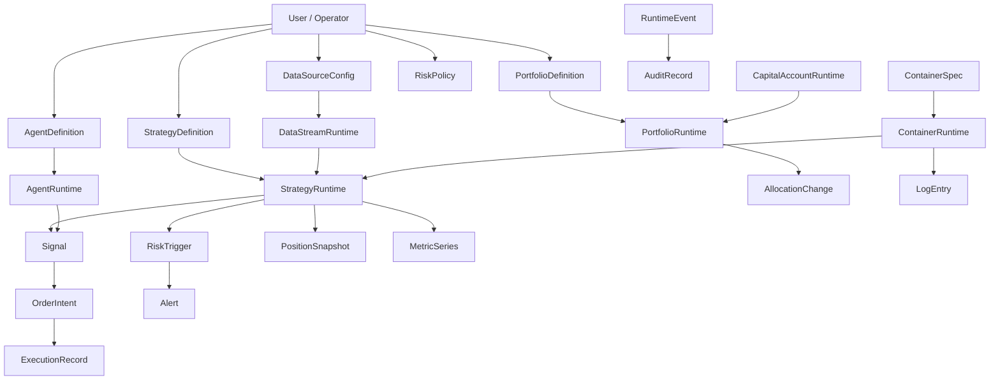

# NEMT Domain Model

## Purpose

This document defines the core domain objects of NEMT Runtime and the
relationships between them.

The goal is not to describe UI screens.
The goal is to define the runtime world itself.

NEMT should be understood as a host for quantitative trading capabilities.
That means the domain model must be able to describe:

- what enters the runtime
- what is configured
- what is running
- what flows between runtime units
- what is executed outside the runtime
- what is observed by operators

## Modeling Rules

The model follows four state categories:

1. Definition
   Persistent, editable, portable descriptions of capabilities.

2. Runtime
   Live operational instances and state.

3. Flow
   Messages, events, intents, and transitions between runtime units.

4. Observation
   Records that explain what happened and what is happening.

Every important concept should eventually fit one or more of these categories.

## Top-Level Domain Map

## Core Entity Families

### 1. Identity and Ownership

These objects answer who defines, controls, or observes runtime objects.

#### User

Represents an authenticated person in the runtime.

Core responsibilities:

- create definitions
- start and stop runtime units
- review alerts and logs
- own subscriptions and permissions

#### OperatorProfile

Represents runtime-specific operator preferences and capabilities.

Possible future concerns:

- preferred views
- workspace presets
- alert preferences
- role-specific permissions

### 2. Ingress and Connectivity

These objects define what the runtime can admit from the outside world.

#### DataSourceConfig

Definition object for a data ingress capability.

Examples:

- exchange API
- WebSocket stream
- CSV/file source
- custom research feed
- synthetic or backtest feed

Concerns:

- provider identity
- credentials
- endpoint
- supported symbols and intervals
- rate limits
- ingress priority

#### DataStreamRuntime

Runtime object representing a live data source connection or stream.

Concerns:

- connected/disconnected state
- freshness
- error rate
- latency
- current subscriptions
- data flow health

Relationship:

- created from one `DataSourceConfig`
- may feed many `StrategyRuntime` instances

### 3. Strategy Family

Strategies are the primary logic units hosted by the runtime.

#### StrategyDefinition

Persistent description of a strategy.

Concerns:

- name
- code or source reference
- parameters
- tags
- supported symbols
- execution assumptions
- risk defaults
- authorship
- publication state

Strategy definitions should not contain live positions or current PnL.

#### StrategyRuntime

Live operational instance of a strategy definition.

Concerns:

- current state
- running/paused/stopped/failure status
- subscribed symbols
- last signal time
- last heartbeat
- current positions
- active orders
- runtime metrics
- container assignment
- capital assignment

Relationship:

- created from one `StrategyDefinition`
- may run inside one `ContainerRuntime`
- may be assisted by one or more `AgentRuntime`
- consumes one or more `DataStreamRuntime` feeds
- emits `Signal`
- emits `RuntimeEvent`

#### StrategySnapshot

Optional observation object that stores a point-in-time summary of a strategy runtime.

Useful for:

- dashboards
- periodic health checks
- performance history

### 4. Portfolio and Capital Family

Portfolios allocate capital and define how strategies are weighted or coordinated.

#### PortfolioDefinition

Persistent configuration for capital allocation logic.

Concerns:

- scoring rules
- allocation rules
- rebalance frequency
- stop-loss thresholds
- strategy inclusion rules
- policy metadata

This is the definition of a capital policy, not the current live balance state.

#### PortfolioRuntime

Live execution state of a portfolio definition.

Concerns:

- current assigned strategies
- current allocations
- rebalance state
- pending allocation changes
- capital efficiency
- drawdown state

Relationship:

- created from one `PortfolioDefinition`
- may reference many `StrategyRuntime`
- consumes capital from one or more `CapitalAccountRuntime`
- emits `AllocationChange`

#### CapitalAccountRuntime

Represents live capital available to the runtime.

Examples:

- simulated capital pool
- live exchange account
- internal paper account
- strategy-specific balance bucket

Concerns:

- available balance
- reserved balance
- realized PnL
- unrealized exposure
- account health

### 5. Container and Compute Family

Containers are runtime hosts, not strategies themselves.

#### ContainerSpec

Persistent description of a runtime host template.

Concerns:

- image
- resources
- environment variables
- ports
- execution environment
- mounted strategy or agent roles

#### ContainerRuntime

Live operational instance of a container host.

Concerns:

- start/stop state
- resource usage
- health state
- current hosted runtimes
- restart count
- logs
- runtime events

Relationship:

- created from one `ContainerSpec`
- may host many runtime units
- may host `StrategyRuntime`, `AgentRuntime`, or helper workers

### 6. Agent Family

Agents are optional decision-support or orchestration units.

#### AgentDefinition

Persistent description of an AI or rule-based agent.

Examples:

- signal assistant
- risk reviewer
- execution optimizer
- research summarizer

Concerns:

- model/provider
- prompt or rule set
- permissions
- allowed contexts
- output contract

#### AgentRuntime

Live running agent instance.

Concerns:

- current context window
- watched runtimes
- output channel
- intervention history
- runtime errors

Relationship:

- created from one `AgentDefinition`
- may observe `StrategyRuntime`, `PortfolioRuntime`, and `DataStreamRuntime`
- may emit `Signal`, `RiskTrigger`, `RuntimeEvent`, or human-facing summaries

### 7. Risk Family

Risk is a first-class governance and control system.

#### RiskPolicy

Persistent definition of risk rules and thresholds.

Concerns:

- max drawdown
- leverage limits
- per-strategy position caps
- account loss thresholds
- auto-action rules

#### RiskTrigger

Flow object representing a risk rule activation.

Concerns:

- what threshold was crossed
- by which runtime object
- severity
- required response

Relationship:

- references one `RiskPolicy`
- references one or more affected runtime entities
- may emit `Alert`
- may pause or constrain `StrategyRuntime` or `PortfolioRuntime`

### 8. Execution Family

Execution is where intent becomes an external or simulated market action.

#### Signal

Flow object emitted by strategy or agent logic.

Concerns:

- symbol
- direction
- confidence
- origin
- reason
- metadata

Signals are not orders.
They are internal intent candidates.

#### OrderIntent

Flow object representing a request to turn a signal into executable action.

Concerns:

- source signal
- target venue
- order type
- size
- risk approval state

#### ExecutionRecord

Observation and state object describing an executed or failed order path.

Concerns:

- requested order
- routed order
- fill details
- slippage
- fees
- status
- failure reason

#### PositionSnapshot

Observation object describing resulting exposure at a point in time.

Concerns:

- symbol
- side
- quantity
- entry price
- mark price
- realized and unrealized PnL

### 9. Event and Timeline Family

This family is what will allow the runtime to become explainable.

#### RuntimeEvent

Canonical event object for lifecycle and system transitions.

Examples:

- strategy started
- container restarted
- stream disconnected
- signal emitted
- risk rule fired
- order rejected

Every important runtime action should eventually emit a `RuntimeEvent`.

#### RuntimeTimeline

Ordered view over `RuntimeEvent` for one entity or one scope.

Scopes may include:

- strategy timeline
- portfolio timeline
- container timeline
- global system timeline

### 10. Observation Family

Observation objects explain and summarize the runtime.

#### Alert

Operator-facing record of something requiring awareness or action.

Sources:

- risk triggers
- runtime failures
- execution failures
- stale data streams

#### MetricSeries

Time-series observation for runtime health and performance.

Examples:

- latency
- fill rate
- drawdown
- CPU usage
- data freshness

#### LogEntry

Human-readable or machine-readable diagnostic record.

Common scopes:

- container logs
- strategy runtime logs
- adapter logs
- agent logs

#### AuditRecord

Governance-oriented record of meaningful changes.

Examples:

- who created a strategy
- who changed a risk policy
- who paused a runtime
- when a container was rebuilt

## Relationship Rules

The following rules should guide future modeling:

### Rule 1: Definitions do not own live state

If an object stores current orders, live PnL, or active health, it is probably runtime state.

### Rule 2: Runtime objects should reference definitions

The runtime should always be able to answer:

- what definition produced this runtime
- what policy governs it
- what container hosts it

### Rule 3: Signals are not orders

Keep these separate:

- decision signal
- execution intent
- execution record

This prevents strategy logic from collapsing into execution plumbing.

### Rule 4: Alerts are not events

Events are raw runtime history.
Alerts are operator-facing significance projections over that history.

### Rule 5: Containers are hosts, not business entities

Do not let container state become the main strategy model.
Containers host runtime units; they do not replace them.

## Near-Term Modeling Priorities

The next useful modeling moves are:

1. Introduce `StrategyDefinition` and `StrategyRuntime`
2. Introduce `ContainerSpec` and `ContainerRuntime`
3. Introduce `PortfolioDefinition` and `PortfolioRuntime`
4. Introduce a canonical `RuntimeEvent`
5. Introduce a lightweight runtime registry that relates these objects

## Desired End State

At maturity, NEMT should be able to answer these questions directly from its model:

- What is defined?
- What is running?
- What is connected?
- What emitted this signal?
- What capital backs this runtime?
- What container hosts it?
- What risk policy governs it?
- What happened before it failed?
- What changed because of this decision?

When the domain model can answer those questions cleanly, the project is large
enough to justify deep, long-horizon token expenditure.
